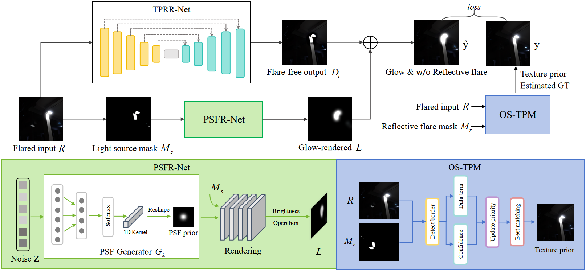
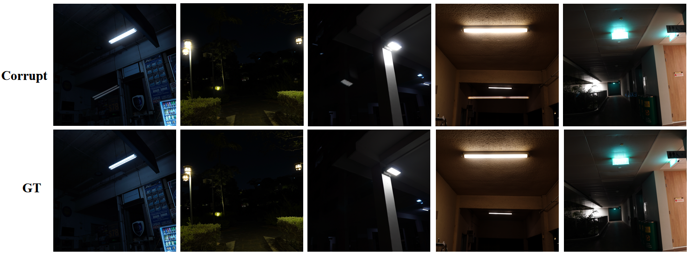
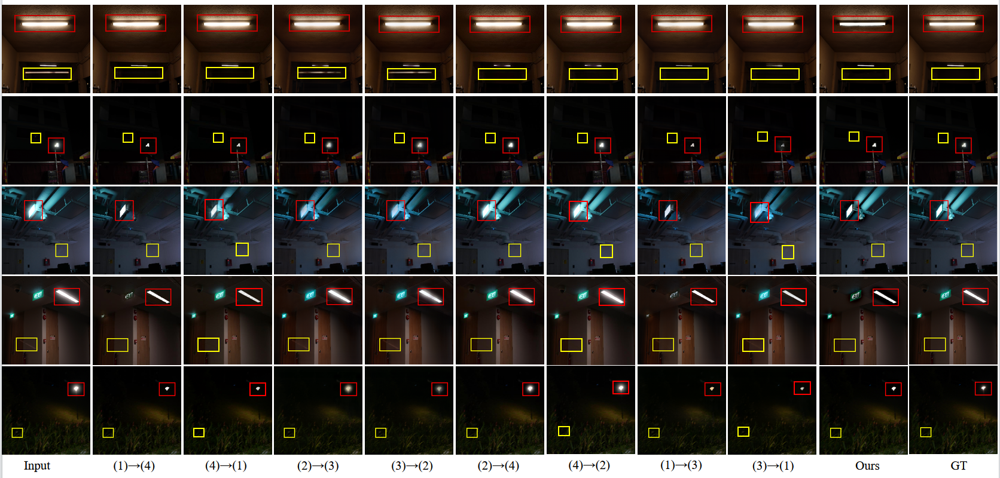
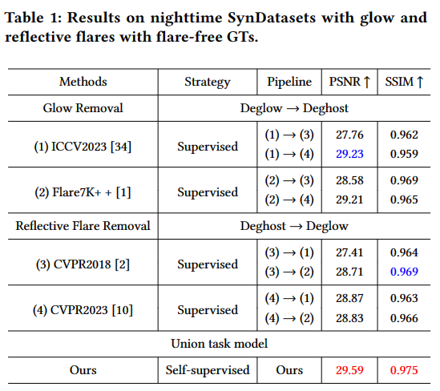

# Disentangle Nighttime Lens Flares: Self-supervised Generation-based Lens Flare Removal

Yuwen He, Wei Wang, Wanyu Wu, Kui Jiang

## Abstract

Lens flare is a frequently observed optical anomaly distinguished by the infiltration of non-image-forming light into the lens system of a camera,where it engages with the imaging sensor. Existing approaches are tailored to address specific types of lens flare, including glow removal,veiling glare removal, reflective flare removal, and so on. However, in real nighttime lens flare, the aforementioned phenomena occur simultaneously and lack attention, for example, simultaneous occurrences of glow and displacement reflections of one light source. These co-occurring nighttime lens flares can not be effectively resolved by the simple combination of glow and reflective flare removal methods, due to the tangled relationship between glow and reflection in their physical model within the same lens system. As the first attempt to tackle this intertwined issue of nighttime lens flare, we rethink this complicated scenario, and reformulate its intrinsic physical model encompassing both glow and reflection. Leveraging this model, we introduce a Self-supervised Generation-based Lens Flare Removal Network (SGLFR-Net) without pre-training, tailored to mitigate lens flare caused by artificial light sources during nighttime, in the absence of real nighttime paired datasets. Specifically, our SGLFR-Net involves two-stream networks, to disentangle nighttime glow and reflective flare based on the PSF rendering prior and optical symmetry based texture prior. For a more comprehensive comparison, we present a new paired testing dataset, termed OurSynDatasets. Experiments show that our method outperforms the SOTAs in the joint task of glow and reflective glare removal with 12% and 6% advances in PSNR and SSIM evaluations, respectively.
<br>

## OurSynDatasets

 The first joint de-glow and de-ghost evaluation dataset. 23 images from [BracketFlare](https://github.com/ykdai/BracketFlare) training data with undiffused glow are selected to synthetic both glow and ghost flared samples with original GTs without flares. 
 [Download](https://drive.google.com/drive/folders/1dpVe04tC_WsBQQayIIEb0HU0-SYA9j3D?usp=sharing)
### Samples of the dataset


### OurSynDatasets test data structure

```
├── OurSynDatasets
    ├── corrupt
    ├── gt
```

### Joint task results

Visual comparison of our SGLFR-Net with eight methods for joint removal of glow and reflection flare fields on OurSynDatasets.


Quantitative comparison of our SGLFR-Net with eight methods for joint removal of glow and reflection flare fields on OurSynDatasets.<br>


The eight joint methods are alignments of two reflection field removal methods [(1),(2)] and two glow field removal methods [(3),(4)], respectively.<br>

- (1):**ICCV2023** Improving Lens Flare Removal with General-Purpose Pipeline and Multiple Light Sources Recovery [[Paper](https://openaccess.thecvf.com/content/ICCV2023/papers/Zhou_Improving_Lens_Flare_Removal_with_General-Purpose_Pipeline_and_Multiple_Light_ICCV_2023_paper.pdf)]
  <br>
- (2):**Flare7k++** Flare7k++: Mixing synthetic and real datasets for nighttime flare removal and beyond [[Paper](https://arxiv.org/pdf/2306.04236.pdf)]
  <br>
- (3):**CVPR2018** Single image reflection separation with perceptual losses [[Paper](https://openaccess.thecvf.com/content_cvpr_2018/papers/Zhang_Single_Image_Reflection_CVPR_2018_paper.pdf)]
  <br>
- (4):**CVPR2023** Nighttime smartphone reflective flare removal using optical center symmetry prior [[Paper](https://openaccess.thecvf.com/content/CVPR2023/papers/Dai_Nighttime_Smartphone_Reflective_Flare_Removal_Using_Optical_Center_Symmetry_Prior_CVPR_2023_paper.pdf)]
